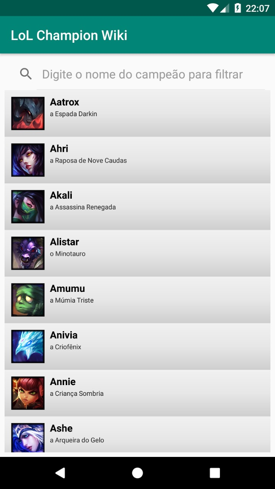
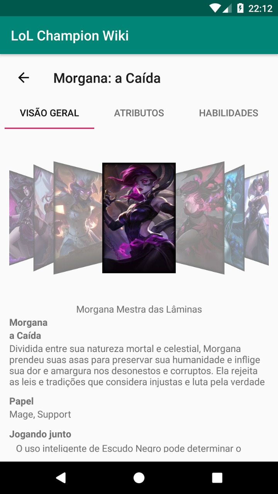
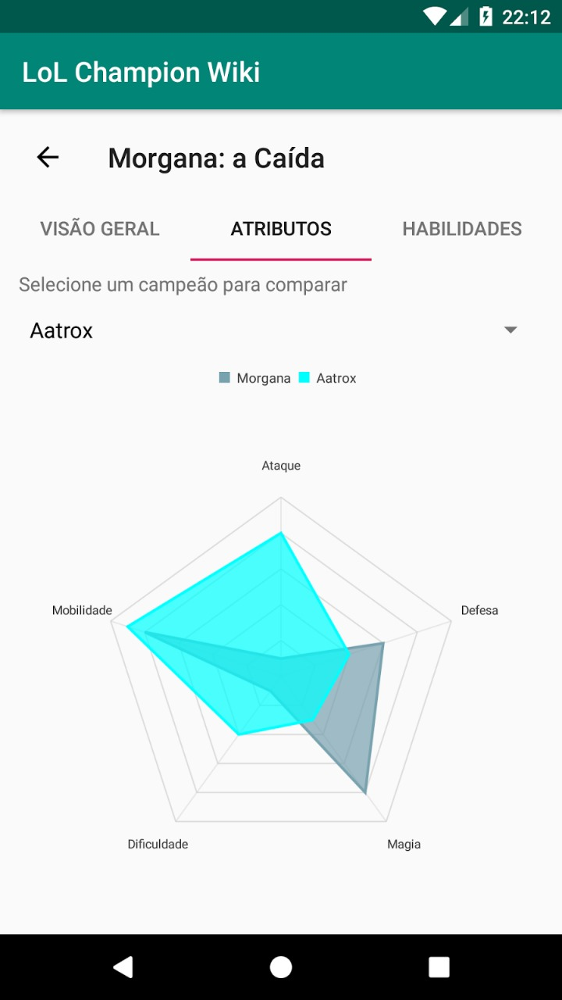
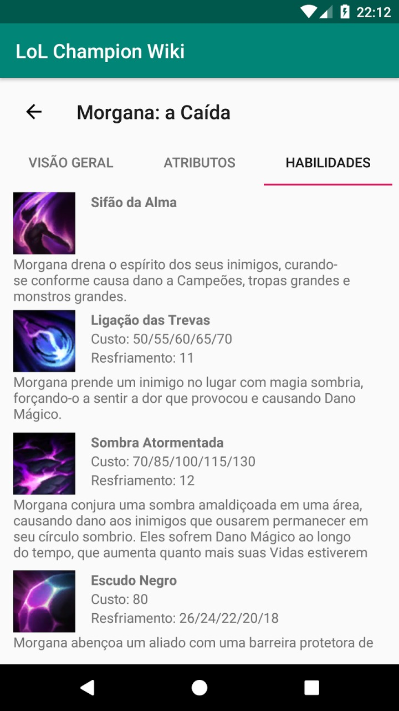

# LoLChampionWiki
Aplicativo para expor informações sobre campeões do jogo League of Legends (LoL).

O objetivo deste aplicativo é explorar o desenvolvimento nativo para plataforma Android.

## Principais implementações
* RecyclerView
* SearchView
* ListView
* AsyncTask
* Toolbar
* ViewPager
* CoverFlowCarousel
* Spinner
* RadarChart
* Internacionalização

## Telas do aplicativo

